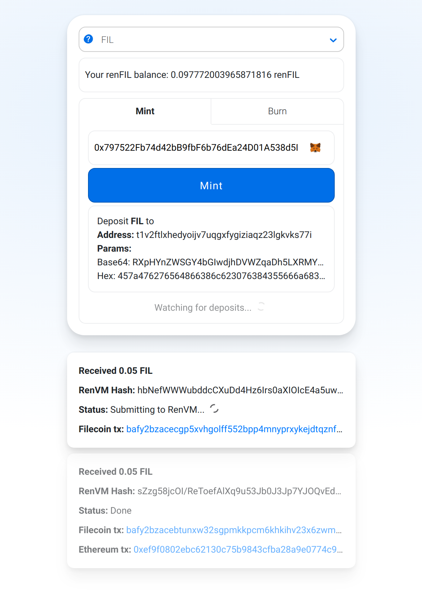

# RenJS v2 Demo

Simple UI to demo RenJS.



## Running locally

Clone this repository and run:

```sh
# Install dependencies:
yarn

# Start development server:
yarn start
```

## RenJS v2 Example

```ts
import { Bitcoin, Ethereum } from "@renproject/chains";
import { renRinkeby } from "@renproject/networks";
import RenJS from "@renproject/ren";
import Web3 from "web3";

export const main = async (web3: Web3) => {
    const renJS = new RenJS("testnet", { logLevel: "log" });

    const lockAndMint = await renJS.lockAndMint({
        asset: "BTC",
        from: Bitcoin(),
        to: Ethereum(web3.currentProvider, undefined, renRinkeby).Account({
            address: "0x1234...",
        }),

        nonce: "0x" + "00".repeat(32),
    });

    console.log(
        `Deposit ${lockAndMint._params.asset} to ${lockAndMint.gatewayAddress}.`,
    );

    lockAndMint.on("deposit", async (deposit) => {
        await deposit
            .confirmed()
            .on("confirmation", (confs, target) =>
                console.log(`Confirmations: ${confs}/${target}`),
            );

        await deposit.signed();
        await deposit
            .mint()
            .on("transactionHash", (txHash) =>
                console.log(`TxHash: ${txHash}`),
            );
    });
};
```
